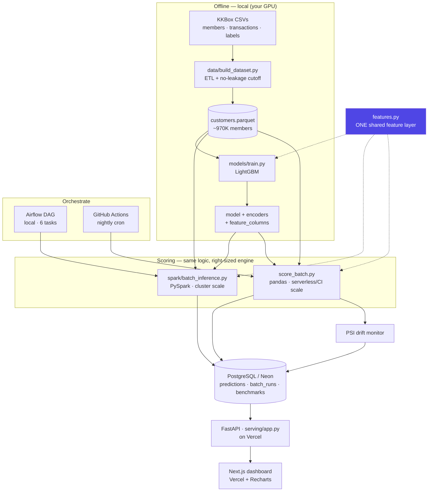

# Batch Inference Pipeline at Scale — Churn Scoring on Real Subscription Data

> Nightly batch ML system that scores ~970K real subscribers for churn using distributed inference, an audit-trailed Postgres store, a serverless API, and a live monitoring dashboard.


> **Status:** mid-build. The full pipeline is implemented and unit-tested; training on the real dataset, first cloud deploy, and end-to-end verification are tracked in **[TODO.md](./TODO.md)** and the [Roadmap](#roadmap) below.

---

## Recruiter TL;DR

- **What it does:** pre-computes churn scores for ~970K real music-streaming subscribers (KKBox dataset) on a schedule, stores every prediction with full lineage, and serves them with sub-lookup latency behind an API + dashboard.
- **Hardest problem solved:** eliminating **train/serve skew** across three inference engines (LightGBM training, PySpark distributed scoring, and a pandas serverless path) by routing all of them through one shared feature module — and fixing a real Spark model-broadcast bug that silently shipped the model into every task.
- *(Impact numbers intentionally omitted — the model has not yet been trained on the real data. Metrics will be added once measured, not estimated.)*

---

## Overview / Motivation

Not every ML prediction needs to be computed on demand. Churn risk doesn't change by the second — computing it once nightly and serving it from an indexed database gives millisecond lookups at a fraction of real-time-inference cost. This is the **pre-compute-and-serve** pattern used for nightly member scoring at companies like LinkedIn, Airbnb, and DoorDash.

This project is a portfolio piece demonstrating that pattern end-to-end on a **real** dataset — the [KKBox Churn Prediction Challenge](https://www.kaggle.com/c/kkbox-churn-prediction-challenge) (WSDM Cup 2018): ~970K labelled subscribers with real demographics and transaction histories. It deliberately spans the full production surface: data engineering, distributed compute, orchestration, an audit trail, a serving API, drift monitoring, a real frontend, CI, and a scheduled deploy.

## Features

- **Real-data ETL** — joins KKBox `members` + `transactions` + labels into a customer-level table, aggregating transaction history into churn signal (auto-renew rate, cancellations, plan price, discount, membership expiry) with an explicit **no-leakage cutoff**.
- **Distributed batch inference** — PySpark `mapInPandas` with a correctly-broadcast LightGBM model (deserialized once per executor, not per row).
- **A right-sized second engine** — a pandas scorer (`score_batch.py`) for the volumes that run in CI/serverless, where Spark's JVM startup is pure overhead. The engine choice is a documented, benchmark-backed decision, not an accident.
- **Zero train/serve skew** — one `features.py` module is imported by training, the Spark job, and the pandas scorer; a unit test asserts the training and inference matrices are byte-identical.
- **Full audit trail** — every score persisted with `run_id`, `model_version`, and `scored_at`; downstream reads the latest score per customer from an indexed view.
- **5-gate validation** — record count, null rate, score range, non-degenerate distribution, and plausible churn rate; a bad batch is rejected before it reaches the serving table.
- **PSI drift monitoring** — Population Stability Index (Basel II standard) between consecutive runs, surfaced on the dashboard.
- **Serverless API + Next.js dashboard** — FastAPI on Vercel serving pre-computed scores; a Next.js + Recharts dashboard for run history, score distribution, benchmark comparison, and customer lookup.

## Architecture



**Why it's shaped this way**

- **Pre-compute, don't infer on request.** Scores are stable over a day, so the API loads *no model* — it reads an indexed Postgres view. Millisecond lookups, ~1/20th the serving cost of live inference.
- **Two engines, one feature layer.** Spark scales to 100M+ rows on a cluster; at the volumes that run in free CI/serverless, the project's own benchmark shows pandas beats local Spark (no JVM startup tax). Rather than pretend Spark is always right, the deployed path uses the right-sized engine — and both share `features.py`, so they can't diverge.
- **The scheduler is the cheapest thing that works.** Airflow models the full 6-task DAG for the local/cluster story; the deployed nightly run is a GitHub Actions cron — free, with public run logs as the orchestration artifact.

## Tech Stack

| Layer | Choice | Why |
|---|---|---|
| Distributed compute | **PySpark 3.5** (`mapInPandas`) | partition-level batched inference; broadcast model |
| Serverless/CI compute | **pandas + LightGBM** | right-sized engine below cluster scale |
| Model | **LightGBM 4.3** | fast gradient boosting; native NaN handling (no imputation skew) |
| Orchestration | **Airflow 2.9** (local) · **GitHub Actions** (deployed) | full DAG locally, free cron in the cloud |
| Database | **PostgreSQL 16** / **Neon** (serverless) | audit trail, indexed views; Neon = free serverless Postgres |
| API | **FastAPI** + async SQLAlchemy/asyncpg | async serving, OpenAPI docs, serverless-friendly |
| Dashboard | **Next.js 14 + TypeScript + Recharts** | real frontend on Vercel (replaces the old Gradio app) |
| Monitoring | **PSI** via NumPy | continuous, trendable drift metric (Basel II) |
| Config | **YAML → typed dataclasses** | one config, env-var overrides, `DATABASE_URL` support |

## Skills Demonstrated

- **Data engineering / ETL** — real multi-file join + aggregation with leakage control (`data/build_dataset.py`)
- **Production ML deployment / MLOps** — serving fully separated from training; shared feature layer; model versioning in the audit trail
- **Distributed & concurrent systems** — PySpark partitioned inference with model broadcasting; async FastAPI
- **System design & architecture** — documented engine-selection and pre-compute tradeoffs
- **Database design** — schema with constraints, indexes, and analytical views (`db/schema.sql`)
- **RESTful API design** — 9 documented endpoints, Pydantic v2 validation
- **Observability & monitoring** — structured logging, `/health`, PSI drift detection
- **Serverless / cloud deployment architecture** — Vercel (API + dashboard) + Neon (configured; first deploy pending)
- **CI/CD** — GitHub Actions for lint + tests + dashboard build, plus a scheduled nightly job
- **Automated testing** — pytest suite pinning the train/serve-parity guarantee

## Getting Started

### Prerequisites
- Docker Desktop (for the local full stack), Python 3.11, Node 20 (for the dashboard)
- A Kaggle account + API token (dataset download)

### 1. Configure
```bash
cp .env.example .env         # local docker-compose reads this automatically
```

### 2. Get the data and train the model
```bash
# One-time: accept the KKBox competition rules on Kaggle, then create an API token.
python data/download_kkbox.py          # members_v3 + transactions_v2 + train_v2
python data/build_dataset.py           # → data/customers.parquet (~970K rows)
python models/train.py --eval          # trains LightGBM, saves artifacts + report
```

### 3. Run the pipeline locally
```bash
# Full stack (Postgres + Spark + Airflow + API):
docker-compose up --build
# Airflow UI  → http://localhost:8081  (admin / admin)
# FastAPI docs → http://localhost:8000/docs

# …or score directly without Spark (the deployed path):
python score_batch.py --skip-postgres      # Parquet only, no DB needed
```

### 4. Run the dashboard
```bash
cd dashboard
cp .env.example .env.local     # set NEXT_PUBLIC_API_URL (default http://localhost:8000)
npm install && npm run dev     # → http://localhost:3000
```

## Usage

Look up a customer's latest score:
```bash
curl http://localhost:8000/score/<customer_id>
```
```json
{
  "customer_id": "…",
  "churn_probability": 0.7312,
  "churn_label": true,
  "churn_decile": 8,
  "risk_tier": "high",
  "model_version": "v1.0.0",
  "run_id": "run-20240101-020000-ab12cd34"
}
```
*(Example shape — actual values depend on the trained model.)*

**API endpoints:** `/health`, `/stats`, `/score/{id}`, `/scores/bulk`, `/batch-runs`, `/batch-runs/latest`, `/batch-runs/{id}`, `/batch-runs/{id}/distribution`, `/benchmark`.

## Project Structure

```
├── data/
│   ├── download_kkbox.py     # fetch the real dataset from Kaggle
│   └── build_dataset.py      # KKBox CSVs → customer-level Parquet (ETL)
├── features.py               # SHARED feature engineering (no train/serve skew)
├── models/train.py           # LightGBM training + evaluation report
├── spark/batch_inference.py  # PySpark mapInPandas scoring (cluster scale)
├── score_batch.py            # pandas scoring (serverless/CI scale) + validation + PSI
├── bench/compare.py          # 3-way benchmark: PySpark vs pandas vs joblib
├── monitoring/score_monitor.py  # PSI drift detection
├── airflow/dags/             # 6-task nightly DAG (local orchestration)
├── db/schema.sql             # Postgres schema: tables, indexes, analytical views
├── serving/                  # FastAPI app (app.py, schemas.py)
├── api/index.py              # Vercel serverless entrypoint → re-exports serving app
├── dashboard/                # Next.js + TypeScript + Recharts monitoring UI
├── tests/                    # pytest: feature parity, scoring, ETL leakage
├── .github/workflows/        # ci.yml (lint+test+build) · nightly.yml (cron scorer)
└── docker-compose.yml        # local full stack
```

## Testing

```bash
pytest -q            # unit tests
python features.py   # runnable train/serve-parity self-check
ruff check . --exclude dashboard
```
Current suite (8 tests) covers the shared feature layer's **train==inference parity**, unseen-category safety, the score-derivation mapping, the ETL's aggregation + no-leakage cutoff, and the validation gates. Run automatically on every push/PR via `.github/workflows/ci.yml`. Coverage is not yet formally measured (tracked in the Roadmap).

## Deployment

**Not yet deployed** — the target architecture is fully configured but the first cloud deploy is pending (see [TODO.md](./TODO.md)):

- **API** → Vercel Python serverless (`api/index.py` + `vercel.json`), reading Neon. `db/connection.py` switches to `NullPool` + disabled statement cache + SSL when running on Vercel (Neon's pooled endpoint).
- **Dashboard** → Vercel (Next.js), pointed at the API via `NEXT_PUBLIC_API_URL`.
- **Database** → Neon serverless Postgres (`DATABASE_URL`).
- **Nightly scoring** → GitHub Actions cron (`.github/workflows/nightly.yml`) runs `score_batch.py` against the committed sample and writes to Neon.

Locally, `docker-compose up --build` brings up the full Postgres + Spark + Airflow + API stack.

## Impact / Results

No performance or accuracy numbers are claimed yet — the model has not been trained on the real dataset in this environment. The benchmark harness (`bench/compare.py`) measures PySpark vs pandas vs joblib throughput across sample sizes; results will be added here once run, rather than estimated. The **qualitative** win is architectural: replacing on-demand inference with pre-computed, indexed lookups, and guaranteeing consistent predictions across three engines via a single feature module.

## Roadmap

Full checklist in **[TODO.md](./TODO.md)**. Highlights:

- [ ] Train on the real KKBox data (local GPU) and publish measured metrics + benchmark numbers here
- [ ] First cloud deploy (Neon + Vercel API + Vercel dashboard) and end-to-end verification
- [ ] Commit the small real sample + model artifacts so the nightly GitHub Actions job runs
- [ ] Formal test-coverage measurement
- [ ] Design polish on the dashboard; ADR docs for the key decisions
- [ ] Model registry / automatic retrain trigger on PSI drift

## License

No license file yet — to be added (MIT is the likely choice for a portfolio project).
